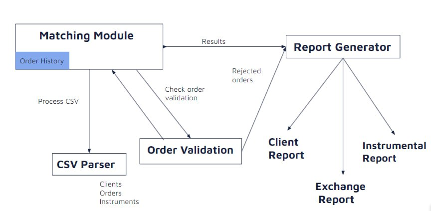

# Bank of America Code to Connect 2024
This was a 8-hour hackathon held on the 13th of May 2024 where we were tasked with building a Matching Engine that matches buy and sell orders with each other, after passing through various validity checks and finally creating csv reports on the trades, holdings and rejected orders.

Although we didn't win the first nor only runner-up place, we made significant progress on the Validity checks (3 static and 1 order history related check), input CSV parsing, the creation of Client, Order and Instrument objects as well as generating the 3 required reports based on executed/rejected trades.

I think overall, the competition was really well thought out and organised. The mentor Shruthi, assigned to us was one of the nicest person I've met. She often checked in with us, and when it came lunch time seeing that we were cramming, she offered to queue and take the food for us, even returning with pictures of the different options available for us to choose at our desk! She felt very, very caring overall and was extremely supportive. She embodies the saying of "People are at the centre of what we do", and I'm certain she'll make a great manager. 

Below are the instructions on how to use our program!

# How to use
Command format: `python3 matcher.py path_to_input_orders.csv path_to_input_clients.csv path_to_input_instruments.csv`

and the output reports will be generated in the directory of matcher.py!

Example:
```
/opt/homebrew/bin/python3 /Users/ethanyuxin/Documents/World/Bank-of-America-Code-to-Connect-2024/matcher.py ./DataSets/test-set/input_orders.csv ./DataSets/test-set/input_clients.csv ./DataSets/test-set/input_instruments.csv
```

# Architecure Diagram


- Our Matching Engine would act as the main instance runner. 
- It first calls the CSV Parser with the file directories of the CSVs provided, and gets back lists of Client, Order and Instrument objects.
- It then validates the order as it attempts to execute each order with Order Validation.
- The Order History in the Matching Module keeps track of information like ORDER_HISTORY, CLIENT_POSITIONS, filtered_orders, INSTRUMENT_DATA, and REJECTED_ORDERS.
- Lastly, the Matching Engine calls the Report Generator to generate all 3 reports. 

# Testing

CSVParserTest.py is one of our testing files.

## Policy testing
Client F is eligible for trading USD but tries to make order for instrument using SGD.

Lot size test check:
Order E5 attempts SIA stock order with 2020, not a multiple of 100.

## Edge case to consider
If Client A makes a buy order of 100, but it is never/not yet fulfilled, then he makes a sell order of 100, it has to be rejected


# Plan moving forward post 13th May:
- Finish Matching Engine
- Build Streamlit dashboard showing orders made
- Try implementation with heap
